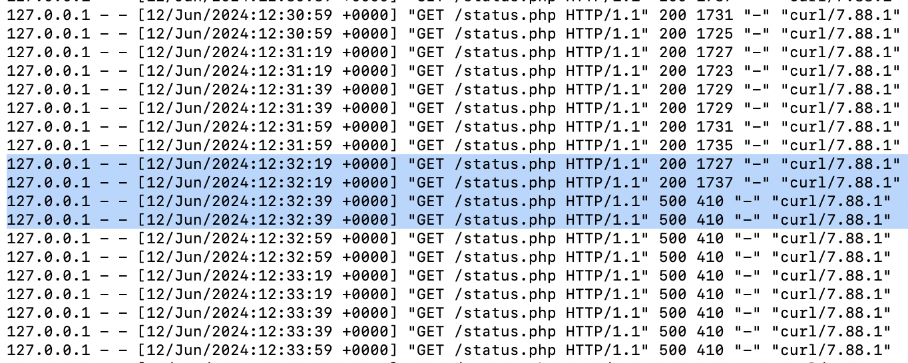

# Лабораторная работа №3

## Ход работы

1. Проверяем, что все успешно установилось


2. Запускаем сервисы 

Делаем это с помощью скрипта run_all.sh:
```
kubectl create -f pg_configmap.yml
kubectl create -f pg_secret.yml
kubectl create -f pg_service.yml
kubectl create -f pg_deployment.yml
kubectl create -f nextcloud.yml
```


## Ответы на вопросы
```
1. важен ли порядок выполнения этих манифестов? Почему?
```
Важен, так как некоторые манифесты используют параметры, передающиеся при выполнении других манифестов. Например, для запуска манифеста Deployment, необходимы пароли и имена, настроенные в манифестах Secret и ConfigMap.

```
Что (и почему) произойдет, если отскейлить количество реплик postgres-deployment в 0, затем обратно в 1, после чего попробовать снова зайти на Nextcloud? 
```

Для nextcloud сnанет недоступна база данных, то есть все данные хранящиеся в postgres ьудут недоступны. 
Когда отскейлим количество реплик обратно в 1, будет создан новый под с БД, но данные не сохранятся, так как не было volume. Это приведет к 500 ошибке в Nextcloud.
На скрине логи некстклауда до и после того, как уронили postgres

