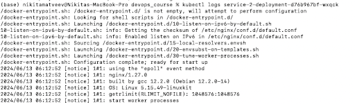

# ДЗ4. More kubernetes

###  Развернутые сервисы
Для выполнения задания были развернуты два сервиса:
1) python app(service-1):
    - Использует кастомный Docker-образ.
    - Включает init-контейнер, который выполняет подготовительные задачи перед запуском основного контейнера.
    - Основной контейнер запускает Python приложение, которое загружает конфигурацию из ConfigMap.
    - Имеет liveness и readiness пробы для проверки состояния контейнера.
    - Обеспечивает доступ к конфигурационным данным через volume, смонтированный из ConfigMap.

2) nginx(service-2):
    - Использует публичный Docker-образ Nginx.
    - Загружает статическое содержимое (HTML файл) из ConfigMap.
    - Служит для отображения веб-страницы с приветственным сообщением.

*Для удобства запуска используется по одному файлу со всеми манифестами на каждый сервис.*

### Шаги выполнения
Шаг 1 - Сборка кастомного Docker образа

Шаг 2 - Применение написанных манифестов

Шаг 3 - Дожидаемся готовности подов

Шаг 4 - Проверяем то, что сервисы работают

---

### Заключение
В результате работы:
- Развернуты два Deployment-а.
- Использован кастомный образ для одного из сервисов.
- В одном из Deployment-ов использован init-контейнер.
- Для обоих сервисов использован volume.
- Созданы ConfigMap для обоих сервисов.
- Создан Service для одного из сервисов.
- Настроены liveness и readiness пробы.
